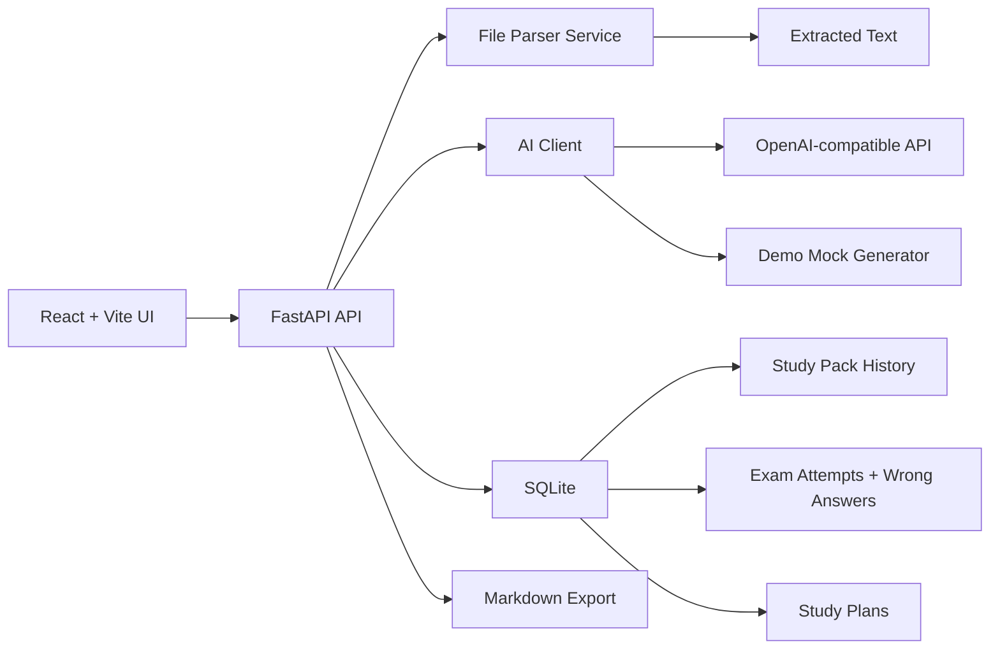
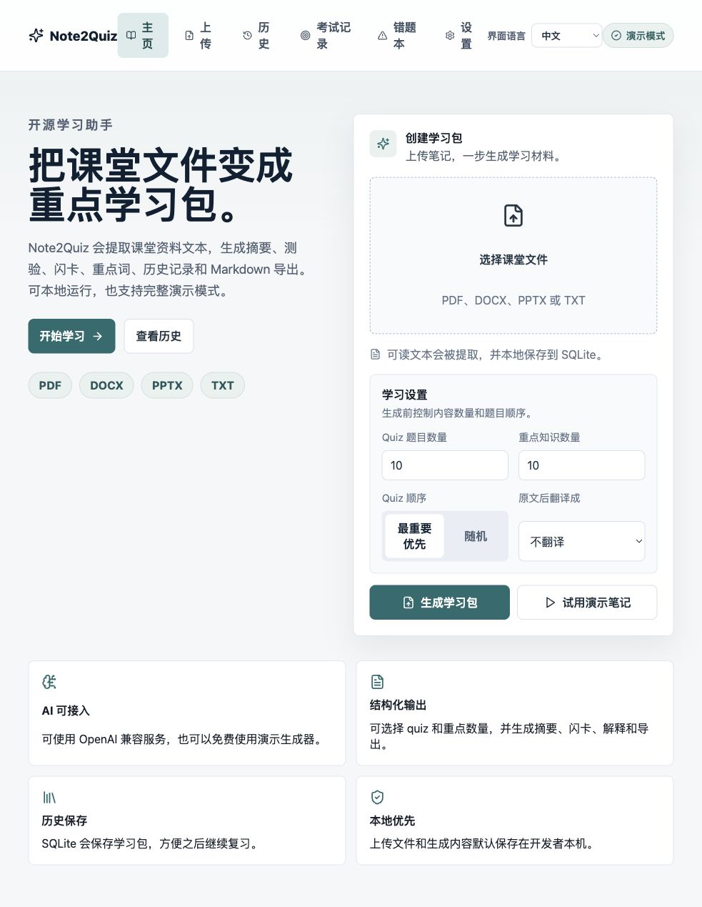
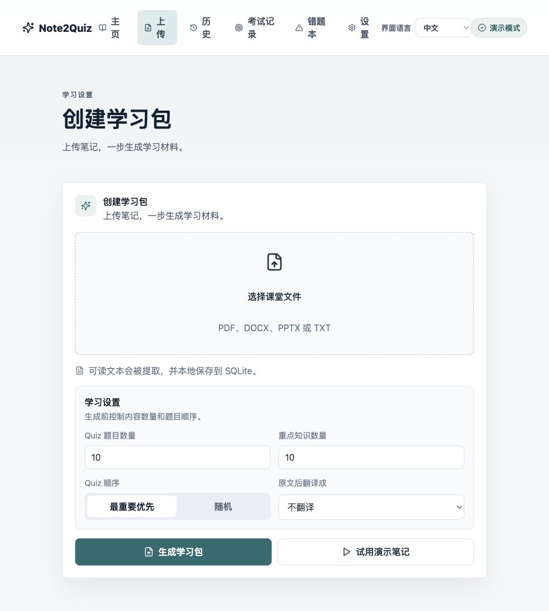
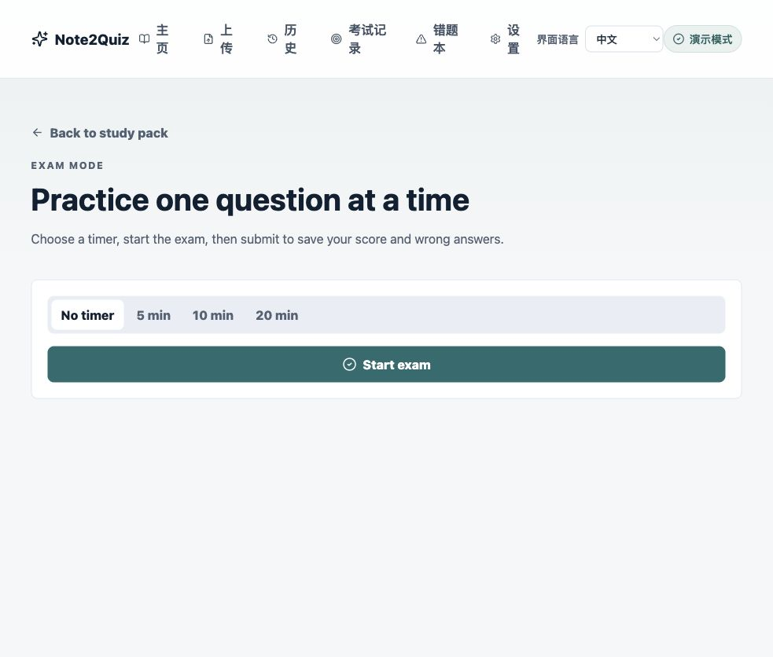
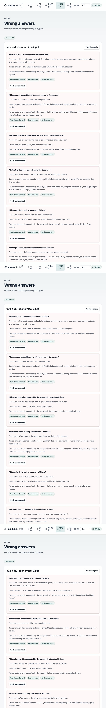

<p align="center">
  <strong>Note2Quiz</strong>
</p>

<p align="center">
  Turn lecture files into summaries, quizzes, exams, flashcards, study plans, favorites, and wrong-answer reviews.
</p>

<p align="center">
  
  
  
  
  
</p>

## Product

Note2Quiz is a local-first AI study system for students. Upload a PDF, DOCX, PPTX, or TXT lecture file and the app extracts readable text, generates a concise study summary, creates configurable multiple-choice quizzes with explanations, builds 20 flashcards, defines configurable key terms, translates source text when an AI provider is configured, creates study plans, runs exam practice, saves wrong answers, stores everything in SQLite, and exports the result as Markdown.

The project supports OpenAI-compatible APIs, but it does not require a paid AI account. If `AI_API_KEY` is missing, Note2Quiz automatically switches into demo mode with realistic mock study material.

## Features

- Upload PDF, DOCX, PPTX, and TXT files
- Extract text with PyMuPDF, python-docx, python-pptx, or a built-in TXT parser
- Generate summaries, quizzes, flashcards, and key terms
- Choose how many quiz questions to generate
- Include explanations, topics, and difficulty labels for quiz answers
- Choose how many key terms to generate, ordered from most important downward
- Generate quizzes in importance order or randomized order
- Generate study material in English, Chinese, French, Russian, or Spanish
- Append translated source text after the original extracted text
- Save uploaded text and generated packs in SQLite
- Browse pack history and reopen saved results
- View outputs in tabs: Summary, Quiz, Flashcards, Key Terms, Study Plan, Favorites, Original Text, Export
- Generate 1-day, 3-day, 5-day, and 7-day study plans
- Favorite quiz explanations, flashcards, and key terms into a review box
- Practice flashcards with "I know this" and "Need review" tracking
- Start Exam Mode from any generated quiz
- Answer one question at a time with progress and optional timer
- Save exam attempts and final scores
- Save wrong answers for targeted review
- Practice wrong questions again from the Wrong Answers page
- Export any study pack as Markdown, JSON, or Anki CSV
- Run with OpenAI-compatible APIs or free demo mode
- Clean responsive React dashboard UI
- FastAPI backend with tests and schema initialization

## Architecture



## Screenshots

### Home



### Upload



### Study Pack


### Exam Mode



### Wrong Answers



## Tech Stack

| Layer | Technology |
| --- | --- |
| Frontend | React, Vite, TypeScript, React Router, lucide-react |
| Backend | Python, FastAPI, Pydantic |
| Database | SQLite |
| Parsing | PyMuPDF, python-docx, python-pptx, TXT |
| AI | OpenAI-compatible `/chat/completions` |
| Tests | pytest, FastAPI TestClient |

## Installation

### Backend

```bash
cd backend
python3 -m venv .venv
source .venv/bin/activate
pip install -r requirements.txt
cp ../.env.example .env
uvicorn main:app --reload --port 8000
```

The API runs at `http://localhost:8000`.

### Frontend

```bash
cd frontend
npm install
npm run dev
```

The app runs at `http://localhost:5173`.

## Environment Variables

Copy `.env.example` to `backend/.env` or project-root `.env`.

| Variable | Required | Description | Default |
| --- | --- | --- | --- |
| `AI_API_KEY` | No | API key for an OpenAI-compatible provider. Empty enables demo mode. | empty |
| `AI_BASE_URL` | No | Base URL for the provider. | `https://api.openai.com/v1` |
| `AI_MODEL` | No | Chat model name. | `gpt-4o-mini` |
| `NOTE2QUIZ_DB_PATH` | No | SQLite database path. | `backend/note2quiz.db` |
| `NOTE2QUIZ_UPLOAD_DIR` | No | Upload storage path. | `backend/uploads` |
| `NOTE2QUIZ_MAX_UPLOAD_BYTES` | No | Max uploaded file size. | `26214400` |
| `NOTE2QUIZ_MIN_EXTRACTED_CHARS` | No | Minimum extracted text length. | `40` |
| `FRONTEND_ORIGIN` | No | Extra CORS origin for deployed frontend. | `http://localhost:5173` |

## AI Provider Setup

Note2Quiz works with providers that expose an OpenAI-compatible chat completions endpoint.

Examples:

- OpenAI
- OpenRouter
- DeepSeek-compatible gateways
- Gemini-compatible gateways that expose OpenAI-style routes
- LM Studio or other local OpenAI-compatible servers

Example:

```bash
AI_API_KEY=sk-your-key
AI_BASE_URL=https://api.openai.com/v1
AI_MODEL=gpt-4o-mini
```

No API key is hardcoded. Users bring their own provider credentials.

## Demo Mode

If `AI_API_KEY` is not set, the backend automatically uses a local mock generator. Demo mode still exercises the full product flow:

1. Upload a file
2. Extract text
3. Generate a realistic summary
4. Create the requested number of quiz questions
5. Create 20 flashcards
6. Create the requested number of key terms
7. Generate study plans
8. Run an exam and save wrong answers
9. Show a clear translation placeholder when no AI key is configured
10. Save the pack in SQLite
11. Export Markdown

Demo mode does not pretend to perform full article translation. Configure an OpenAI-compatible provider for full-quality translation and multilingual generation.

This makes the project easy to evaluate without spending money.

## Exam Mode

Every generated quiz can be used as an exam. Exam Mode shows one question at a time, includes a progress indicator, supports optional timers, records selected answers, calculates the final score, and displays a review page with correct answers, wrong answers, explanations, and the final score.

Exam attempts are saved in SQLite so students can track practice history over time.

## Wrong Answer Review

Wrong answers from completed exams are saved automatically. The Wrong Answers page groups misses by study pack and shows:

- question
- user answer
- correct answer
- explanation
- weak topic
- review count
- source study pack

Students can jump back into Exam Mode to practice missed material again.

## Favorites and Flashcard Practice

Students can favorite quiz explanations, flashcards, and key terms into a focused review box. Flashcards include a simple practice mode with "I know this" and "Need review" actions. Flashcards can also be exported as Anki CSV.

## Study Plan Generator

The Study Plan tab creates 1-day cram, 3-day, 5-day, or 7-day plans from the current study pack. In demo mode, plans are generated locally from summary, flashcards, quiz items, wrong-answer review, and key terms. With an AI provider configured, this area can be extended to request richer provider-generated plans.

## Privacy

- No API keys are committed.
- Users provide their own AI provider credentials through environment variables.
- Uploaded files are stored locally in `backend/uploads`.
- Generated study packs, exam attempts, favorites, and wrong answers are stored locally in SQLite.
- Mock mode is available without paid services.

## API

| Method | Route | Description |
| --- | --- | --- |
| `POST` | `/api/upload` | Upload and parse a lecture file |
| `POST` | `/api/generate/{file_id}` | Generate or return the study pack for an upload |
| `GET` | `/api/packs` | List saved study packs |
| `GET` | `/api/packs/{pack_id}` | Get one study pack |
| `GET` | `/api/export/{pack_id}` | Export one pack as Markdown |
| `GET` | `/api/export/{pack_id}/markdown` | Export Markdown |
| `GET` | `/api/export/{pack_id}/json` | Export JSON |
| `GET` | `/api/export/{pack_id}/anki` | Export Anki CSV |
| `POST` | `/api/packs/{pack_id}/exam/start` | Start an exam attempt |
| `POST` | `/api/packs/{pack_id}/exam/submit` | Submit exam answers and save wrong answers |
| `GET` | `/api/exam-attempts` | List exam attempt history |
| `GET` | `/api/exam-attempts/{attempt_id}` | Get exam attempt detail |
| `GET` | `/api/wrong-answers` | List saved wrong answers |
| `GET` | `/api/packs/{pack_id}/wrong-answers` | List wrong answers for one pack |
| `POST` | `/api/wrong-answers/{wrong_answer_id}/review` | Mark a wrong answer reviewed |
| `POST` | `/api/packs/{pack_id}/study-plan` | Generate or return a study plan |
| `GET` | `/api/packs/{pack_id}/study-plan` | List generated study plans |
| `GET` | `/api/packs/{pack_id}/favorites` | List favorites |
| `POST` | `/api/packs/{pack_id}/favorites` | Save a favorite item |
| `DELETE` | `/api/favorites/{favorite_id}` | Remove a favorite item |
| `GET` | `/api/packs/{pack_id}/flashcards/export/anki` | Export flashcards as Anki CSV |

## Deployment Notes

### Frontend on Vercel

- Root directory: `frontend`
- Build command: `npm run build`
- Output directory: `dist`
- Set `VITE_API_BASE` to the deployed backend URL.

### Backend on Render

- Root directory: `backend`
- Install command: `pip install -r requirements.txt`
- Start command: `uvicorn main:app --host 0.0.0.0 --port $PORT`
- Set `FRONTEND_ORIGIN` to your deployed frontend URL.

## Verification

```bash
python -m compileall backend
cd backend && pytest
cd frontend && npm run build
```

## Recommended GitHub Topics

`ai`, `education`, `study-assistant`, `quiz-generator`, `flashcards`, `react`, `fastapi`, `openai`, `deepseek`, `gemini`

## Roadmap

- Add richer AI-generated study plans
- Add spaced repetition scheduling for wrong answers
- Add PDF export for study packs and exam reviews
- Add streaming generation progress for AI providers
- Add search and tags for saved packs
- Add Docker Compose for one-command startup
- Add GitHub Actions CI
- Add optional user accounts for hosted deployments

## Contributing

Contributions are welcome. Start with [CONTRIBUTING.md](CONTRIBUTING.md), keep changes focused, add tests for backend behavior, and include screenshots for meaningful UI changes.

## License

MIT. See [LICENSE](LICENSE).
