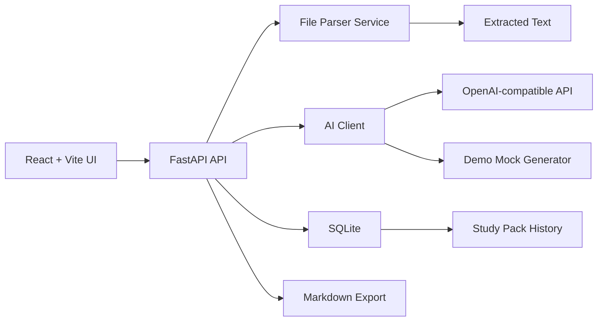

<p align="center">
  <strong>Note2Quiz</strong>
</p>

<p align="center">
  Turn lecture files into summaries, quizzes, flashcards, key terms, and Markdown study packs.
</p>

<p align="center">
  
  
  
  
  
</p>

## Product

Note2Quiz is a local-first study assistant for students. Upload a PDF, DOCX, PPTX, or TXT lecture file and the app extracts readable text, generates a concise study summary, creates a 10-question multiple-choice quiz, builds 20 flashcards, defines key terms, saves everything in SQLite, and exports the result as Markdown.

The project supports OpenAI-compatible APIs, but it does not require a paid AI account. If `AI_API_KEY` is missing, Note2Quiz automatically switches into demo mode with realistic mock study material.

## Features

- Upload PDF, DOCX, PPTX, and TXT files
- Extract text with PyMuPDF, python-docx, python-pptx, or a built-in TXT parser
- Generate summaries, quizzes, flashcards, and key terms
- Save uploaded text and generated packs in SQLite
- Browse pack history and reopen saved results
- View outputs in tabs: Summary, Quiz, Flashcards, Key Terms, Original Text
- Export any study pack as Markdown
- Run with OpenAI-compatible APIs or free demo mode
- Clean responsive React dashboard UI
- FastAPI backend with tests and schema initialization

## Architecture



## Screenshots

Add screenshots here after running the app:

- Home dashboard
- Upload page
- Study pack tabs
- History page

## Tech Stack

| Layer | Technology |
| --- | --- |
| Frontend | React, Vite, TypeScript, React Router, lucide-react |
| Backend | Python, FastAPI, Pydantic |
| Database | SQLite |
| Parsing | PyMuPDF, python-docx, python-pptx, TXT |
| AI | OpenAI-compatible `/chat/completions` |
| Tests | pytest, FastAPI TestClient |

## Installation

### Backend

```bash
cd backend
python3 -m venv .venv
source .venv/bin/activate
pip install -r requirements.txt
cp ../.env.example .env
uvicorn main:app --reload --port 8000
```

The API runs at `http://localhost:8000`.

### Frontend

```bash
cd frontend
npm install
npm run dev
```

The app runs at `http://localhost:5173`.

## Environment Variables

Copy `.env.example` to `backend/.env` or project-root `.env`.

| Variable | Required | Description | Default |
| --- | --- | --- | --- |
| `AI_API_KEY` | No | API key for an OpenAI-compatible provider. Empty enables demo mode. | empty |
| `AI_BASE_URL` | No | Base URL for the provider. | `https://api.openai.com/v1` |
| `AI_MODEL` | No | Chat model name. | `gpt-4o-mini` |
| `NOTE2QUIZ_DB_PATH` | No | SQLite database path. | `backend/note2quiz.db` |
| `NOTE2QUIZ_UPLOAD_DIR` | No | Upload storage path. | `backend/uploads` |

## AI Provider Setup

Note2Quiz works with providers that expose an OpenAI-compatible chat completions endpoint.

Examples:

- OpenAI
- OpenRouter
- DeepSeek-compatible gateways
- Gemini-compatible gateways that expose OpenAI-style routes
- LM Studio or other local OpenAI-compatible servers

Example:

```bash
AI_API_KEY=sk-your-key
AI_BASE_URL=https://api.openai.com/v1
AI_MODEL=gpt-4o-mini
```

No API key is hardcoded. Users bring their own provider credentials.

## Demo Mode

If `AI_API_KEY` is not set, the backend automatically uses a local mock generator. Demo mode still exercises the full product flow:

1. Upload a file
2. Extract text
3. Generate a realistic summary
4. Create 10 quiz questions
5. Create 20 flashcards
6. Create key terms
7. Save the pack in SQLite
8. Export Markdown

This makes the project easy to evaluate without spending money.

## API

| Method | Route | Description |
| --- | --- | --- |
| `POST` | `/api/upload` | Upload and parse a lecture file |
| `POST` | `/api/generate/{file_id}` | Generate or return the study pack for an upload |
| `GET` | `/api/packs` | List saved study packs |
| `GET` | `/api/packs/{pack_id}` | Get one study pack |
| `GET` | `/api/export/{pack_id}` | Export one pack as Markdown |

## Verification

```bash
python -m compileall backend
cd backend && pytest
cd frontend && npm run build
```

## Recommended GitHub Topics

`ai`, `education`, `study-assistant`, `quiz-generator`, `flashcards`, `react`, `fastapi`, `openai`, `deepseek`, `gemini`

## Roadmap

- Add Anki CSV export
- Add PDF export for study packs
- Add local chunking for very large lecture files
- Add streaming generation progress
- Add search and tags for saved packs
- Add Docker Compose for one-command startup
- Add GitHub Actions CI
- Add optional user accounts for hosted deployments

## Contributing

Contributions are welcome. Start with [CONTRIBUTING.md](CONTRIBUTING.md), keep changes focused, add tests for backend behavior, and include screenshots for meaningful UI changes.

## License

MIT. See [LICENSE](LICENSE).
